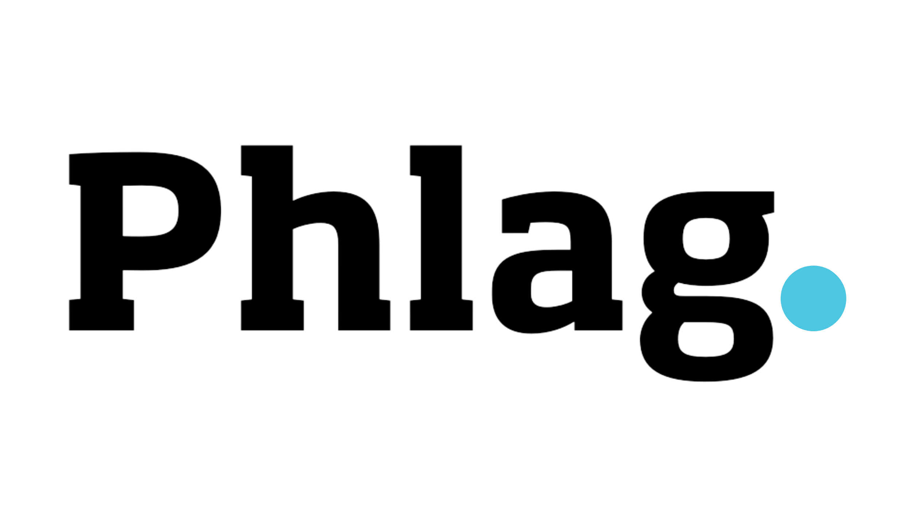

More ~~propaganda~~ information about this can be found at [https://helpphocassoftware.atlassian.net/wiki/spaces/~752526820/pages/2857042010/Phlag+-+A+Feature+Flag+tool+for+Phocas](https://helpphocassoftware.atlassian.net/wiki/spaces/~752526820/pages/2857042010/Phlag+-+A+Feature+Flag+tool+for+Phocas).

## Get the Source

Clone the repo and install the dependencies:

```bash
git clone https://github.com/seanmadondo/phocas-phlag.git
cd phocas-phlag
yarn
```

## Build UserScript

Build the script by running the following:

```bash
yarn build
```

This will use WebPack to bundle the source and apply the UserScript header to the output. The file can be found in `dist/phocas-phlag.bundle.js`. The contents of this file will also be copied to the clipboard.

## Feature List

- [x] MVP
- [x] Convert to TypeScript
- [x] Phlag overlay will fade in on ALT + P
- [x] Phlag overlay will fade out on ALT + P
- [x] Ensure input HTML is not overriden
- [x] Ensure stable
